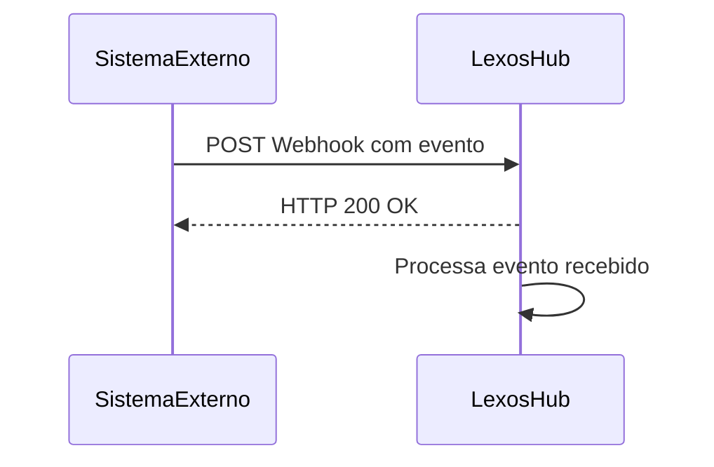
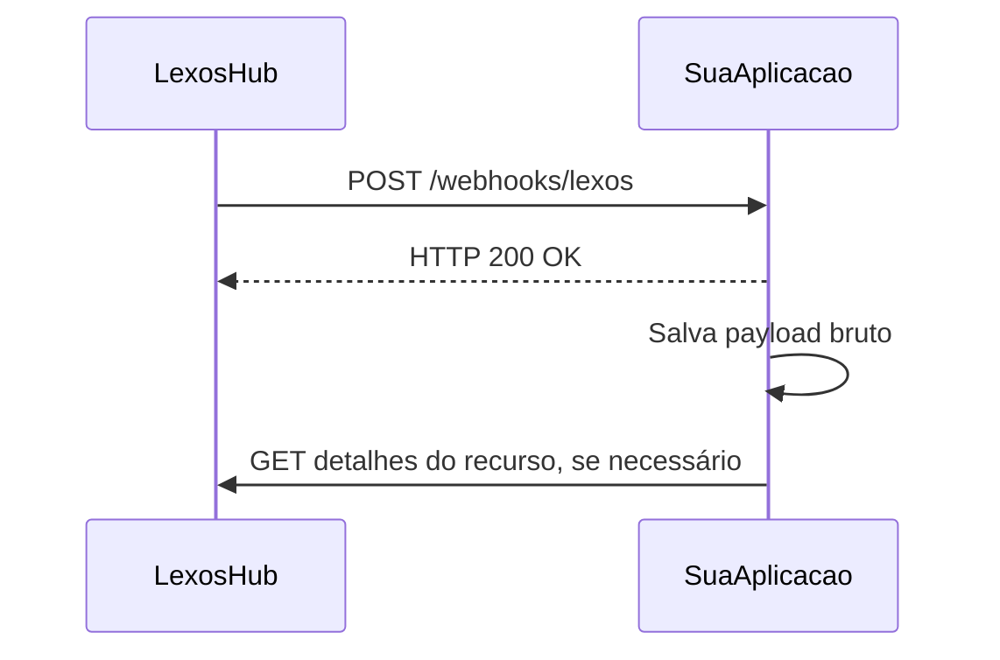
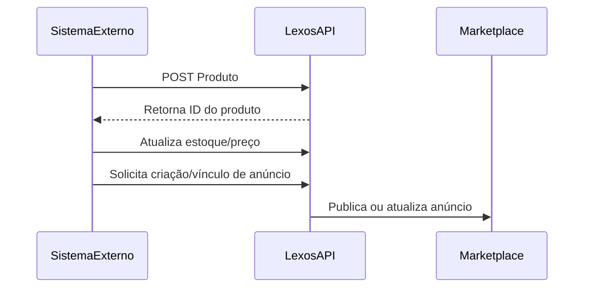
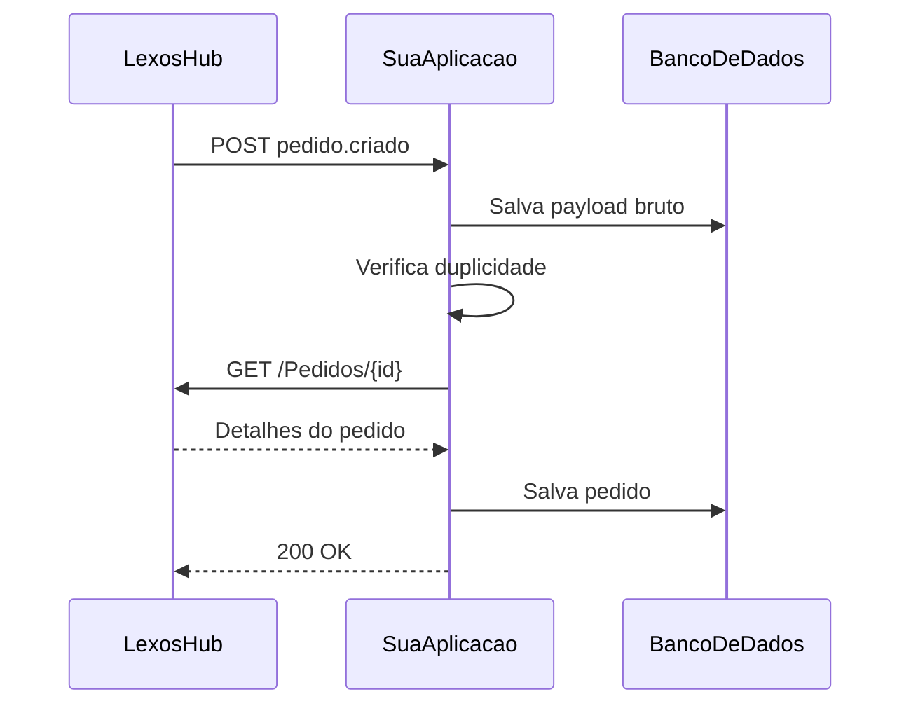
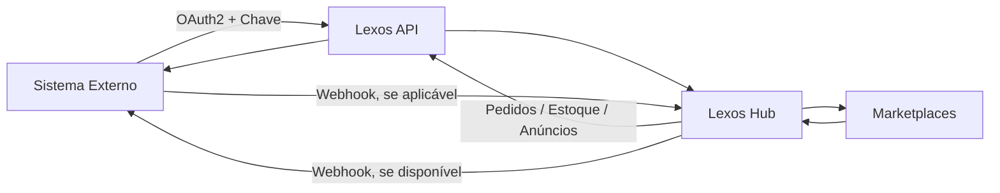

# Integração Lexos Hub API

> Documento técnico resumido para orientar uma integração com o Lexos Hub usando API e Webhook.  
> **Importante:** a lista completa de endpoints e os schemas oficiais ficam no portal de desenvolvedor da Lexos, que exige login. Portanto, os nomes de endpoints e payloads de produto/pedido abaixo devem ser tratados como **modelo de implementação** e precisam ser validados no portal autenticado da Lexos API antes do desenvolvimento final.

---

## 1. Visão geral do Lexos Hub

O **Lexos Hub** é uma plataforma de integração para marketplaces, e-commerces e ERPs. A proposta é centralizar a operação de vendas online, permitindo gerenciar produtos, anúncios, pedidos, estoque, expedição, faturamento e integrações com canais como marketplaces e lojas virtuais.

Em um cenário de integração via API, o Lexos Hub pode atuar como o centro da operação, enquanto o sistema externo pode:

- Criar ou atualizar produtos;
- Sincronizar preço e estoque;
- Consultar pedidos;
- Receber ou enviar notificações via Webhook;
- Atualizar status operacionais;
- Integrar dados com ERP, loja virtual, marketplace ou sistema interno.

---

## 2. Pontos oficiais confirmados na documentação pública

A documentação pública da Lexos informa que:

- O portal de APIs está disponível em `https://lexosapi.developer.azure-api.net/apis`;
- Para ver a lista completa das APIs é necessário fazer login no portal de desenvolvedor;
- A integração com a API deve ser criada dentro do Lexos Hub, na área de **Integrações**;
- O administrador do Lexos Hub deve criar uma integração do tipo **Lexos API**;
- A chave segura da integração deve ser enviada em todas as requisições pelo header `Chave`;
- O processo de autenticação utiliza **OAuth2 com Authorization Code Grant**;
- O `access_token` deve ser usado nas chamadas da API;
- O `refresh_token` deve ser usado para renovar o token quando ele expirar;
- A Lexos informa que não há ambiente de homologação, recomendando criar produtos e anúncios de teste dentro da própria conta do Hub;
- Nas configurações avançadas da integração existe opção relacionada ao recebimento de notificações via Webhook.

---

## 3. Contas necessárias

A Lexos separa o acesso em três tipos principais:

### 3.1 Usuário

Conta utilizada pelo cliente final/administrador que acessa o Lexos Hub.

Responsável por:

- Acessar o painel do Hub;
- Criar a integração **Lexos API**;
- Gerar a chave segura da integração;
- Habilitar configurações avançadas, como Webhook.

### 3.2 Desenvolvedor

Conta usada para acessar o portal de documentação das APIs.

Responsável por:

- Consultar endpoints;
- Ver schemas oficiais;
- Entender payloads;
- Validar formatos de requisição e resposta.

### 3.3 Aplicação

Conta usada pela aplicação integrada.

Responsável por:

- Autenticar via OAuth2;
- Obter `access_token`;
- Obter `refresh_token`;
- Consumir as APIs do Lexos Hub.

Recomendação operacional:

- Criar uma conta de aplicação para desenvolvimento/testes;
- Criar outra conta de aplicação exclusiva para produção;
- Evitar usar a mesma conta/token para ambientes diferentes.

---

## 4. Como criar a integração no Lexos Hub

Fluxo esperado:

1. Acessar o **Lexos Hub**;
2. Entrar em **Integrações**;
3. Clicar em **+ Adicionar**;
4. Selecionar **Lexos API**;
5. Clicar em **Criar**;
6. Informar o nome da integração;
7. Gerar/copiar a chave de autenticação;
8. Configurar as opções avançadas, incluindo Webhook, quando necessário;
9. Salvar a integração.

A chave gerada nessa etapa deve ser enviada no header das chamadas para a API:

```http
Chave: SUA_CHAVE_DA_INTEGRACAO
```

---

## 5. Autenticação OAuth2

A autenticação informada pela Lexos usa o fluxo **OAuth2 Authorization Code Grant**.

### 5.1 Obter o código de autorização

O usuário/desenvolvedor deve acessar via navegador:

```text
https://api.lexos.com.br/Autenticacao/
```

Após informar as credenciais da aplicação, a Lexos redireciona para uma URL contendo o parâmetro `code`.

Exemplo ilustrativo:

```text
https://sua-url-de-retorno.com/callback?code=CODIGO_GERADO_PELA_LEXOS
```

### 5.2 Trocar o `code` por tokens

Após obter o `code`, a aplicação deve fazer uma requisição para o endpoint oficial de token.

Modelo informado publicamente:

```http
POST /Autenticacao/token
Host: api.lexos.com.br
Content-Type: application/json
```

Exemplo conceitual de body:

```json
{
  "code": "CODIGO_GERADO_PELA_LEXOS"
}
```

Resposta esperada:

```json
{
  "access_token": "TOKEN_DE_ACESSO",
  "refresh_token": "TOKEN_DE_RENOVACAO",
  "expires_in": 3600,
  "token_type": "Bearer"
}
```

### 5.3 Usar o token nas requisições

Todas as chamadas autenticadas devem enviar o token no header `Authorization` e a chave da integração no header `Chave`.

```http
Authorization: Bearer TOKEN_DE_ACESSO
Chave: SUA_CHAVE_DA_INTEGRACAO
Content-Type: application/json
```

### 5.4 Renovar o access token

Quando o `access_token` expirar, utilize o `refresh_token`.

Modelo informado publicamente:

```http
POST /Autenticacao/RefreshToken
Host: api.lexos.com.br
Content-Type: application/json
```

Exemplo conceitual:

```json
{
  "refresh_token": "TOKEN_DE_RENOVACAO"
}
```

---

## 6. Como funciona o Webhook

Webhook é uma comunicação automática entre sistemas, normalmente feita por uma requisição HTTP `POST` enviada quando determinado evento acontece.

Existem dois cenários possíveis em uma integração com Lexos:

### 6.1 Cenário A — Sistema externo envia eventos para o Lexos

A documentação pública da integração Lexos API menciona a possibilidade de habilitar o Lexos para **receber notificações via Webhook**.

Nesse modelo, o sistema externo envia dados para o endpoint configurado pela Lexos quando um evento acontece.

Exemplos de eventos:

- Produto criado no sistema externo;
- Produto atualizado;
- Estoque alterado;
- Pedido criado na loja;
- Pedido pago;
- Pedido cancelado;
- Nota fiscal emitida;
- Status logístico alterado.

Fluxo:



### 6.2 Cenário B — Lexos envia eventos para o sistema externo

Caso a API autenticada da Lexos ofereça Webhook de saída, o fluxo seria o inverso: o Lexos enviaria uma requisição para uma URL da sua aplicação.

Esse ponto precisa ser confirmado dentro do portal autenticado da Lexos API.

Fluxo esperado:



---

## 7. Endpoint receptor de Webhook na sua aplicação

Exemplo de URL que a sua aplicação poderia disponibilizar:

```http
POST https://sua-api.com.br/webhooks/lexos
```

Headers esperados/recomendados:

```http
Content-Type: application/json
User-Agent: Lexos-Webhook
X-Webhook-Event: pedido.criado
X-Webhook-Id: evt_123456
```

> Os nomes dos headers acima são apenas sugestão técnica. Confirme no portal da Lexos quais headers oficiais são enviados ou exigidos.

### 7.1 Exemplo de payload de Webhook de pedido

```json
{
  "event": "pedido.criado",
  "event_id": "evt_123456",
  "created_at": "2026-05-12T10:30:00-03:00",
  "resource": "pedido",
  "data": {
    "pedido_id": "123456",
    "numero_pedido": "MLB-998877",
    "canal": "Mercado Livre",
    "status": "novo",
    "cliente": {
      "nome": "Cliente Exemplo",
      "documento": "00000000000",
      "email": "cliente@email.com",
      "telefone": "21999999999"
    },
    "itens": [
      {
        "sku": "MAXXX-001",
        "nome": "Guarda Roupa Benfica 6 Portas",
        "quantidade": 1,
        "valor_unitario": 1299.9
      }
    ],
    "entrega": {
      "cep": "24700000",
      "cidade": "São Gonçalo",
      "uf": "RJ",
      "endereco": "Rua Exemplo",
      "numero": "100",
      "bairro": "Centro"
    },
    "pagamento": {
      "metodo": "marketplace",
      "valor_total": 1299.9
    }
  }
}
```

### 7.2 Exemplo de resposta correta ao Webhook

A aplicação deve responder rápido, preferencialmente sem processar tudo na mesma requisição.

```http
HTTP/1.1 200 OK
Content-Type: application/json
```

```json
{
  "received": true
}
```

### 7.3 Boas práticas para Webhook

- Responder `200 OK` rapidamente;
- Salvar o payload bruto recebido;
- Processar em fila/worker quando possível;
- Validar assinatura, token ou chave, se a Lexos disponibilizar;
- Criar controle de idempotência para não duplicar pedidos;
- Usar `event_id`, `pedido_id` ou `numero_pedido` como chave de controle;
- Ignorar eventos duplicados já processados;
- Registrar logs de erro;
- Nunca expor `access_token`, `refresh_token` ou `Chave` em logs públicos.

---

## 8. Criação de produto

A criação de produto deve seguir o schema oficial da API da Lexos. Como a documentação pública não expõe os endpoints de produto sem login, abaixo está um modelo conceitual para orientar o desenvolvimento.

### 8.1 Fluxo recomendado

1. Validar se o SKU já existe;
2. Preparar dados básicos do produto;
3. Enviar produto para a Lexos API;
4. Salvar o ID retornado pela Lexos;
5. Enviar imagens, se houver endpoint separado;
6. Atualizar estoque;
7. Atualizar preço;
8. Criar ou vincular anúncio, caso a integração use marketplace;
9. Registrar logs da sincronização.

Fluxo:



### 8.2 Endpoint conceitual

> Validar o caminho real no portal da Lexos API.

```http
POST /Produtos
Host: api.lexos.com.br
Authorization: Bearer TOKEN_DE_ACESSO
Chave: SUA_CHAVE_DA_INTEGRACAO
Content-Type: application/json
```

### 8.3 Payload conceitual de produto

```json
{
  "sku": "MAXXX-001",
  "nome": "Guarda Roupa Benfica 6 Portas 6 Gavetas com Espelho",
  "descricao": "Guarda roupa amplo, com 6 portas, 6 gavetas e espelho. Ideal para quartos de casal.",
  "marca": "Atualle",
  "categoria": "Guarda Roupa",
  "codigo_barras": "7890000000000",
  "ncm": "94035000",
  "preco_venda": 1299.9,
  "preco_promocional": 1199.9,
  "estoque": 10,
  "peso": 90.5,
  "dimensoes": {
    "altura": 220,
    "largura": 240,
    "profundidade": 50
  },
  "imagens": [
    "https://sua-loja.com.br/imagens/produto-001-1.jpg",
    "https://sua-loja.com.br/imagens/produto-001-2.jpg"
  ],
  "atributos": [
    {
      "nome": "Cor",
      "valor": "Off White/Nature"
    },
    {
      "nome": "Quantidade de Portas",
      "valor": "6"
    },
    {
      "nome": "Quantidade de Gavetas",
      "valor": "6"
    }
  ]
}
```

### 8.4 Resposta conceitual

```json
{
  "id": "98765",
  "sku": "MAXXX-001",
  "status": "criado",
  "created_at": "2026-05-12T10:30:00-03:00"
}
```

### 8.5 Cuidados na criação de produto

- O SKU deve ser único;
- Nome e descrição devem seguir o padrão do canal de venda;
- Conferir campos fiscais como NCM, origem e unidade;
- Conferir peso e dimensões para cálculo de frete;
- Usar URLs de imagens públicas e acessíveis;
- Validar variações, como cor, tamanho e voltagem, quando existirem;
- Em marketplaces, produto e anúncio podem ser entidades diferentes.

---

## 9. Atualização de preço e estoque

Preço e estoque costumam ser informações sensíveis, pois impactam diretamente a venda nos marketplaces.

### 9.1 Fluxo recomendado

1. Sistema externo identifica alteração;
2. Atualiza produto/estoque na Lexos API;
3. Lexos propaga para os canais integrados;
4. Sistema externo registra sucesso ou falha.

### 9.2 Endpoint conceitual de estoque

```http
PUT /Produtos/{produto_id}/Estoque
Host: api.lexos.com.br
Authorization: Bearer TOKEN_DE_ACESSO
Chave: SUA_CHAVE_DA_INTEGRACAO
Content-Type: application/json
```

```json
{
  "sku": "MAXXX-001",
  "quantidade": 10,
  "deposito": "Loja Principal"
}
```

### 9.3 Endpoint conceitual de preço

```http
PUT /Produtos/{produto_id}/Preco
Host: api.lexos.com.br
Authorization: Bearer TOKEN_DE_ACESSO
Chave: SUA_CHAVE_DA_INTEGRACAO
Content-Type: application/json
```

```json
{
  "sku": "MAXXX-001",
  "preco_venda": 1299.9,
  "preco_promocional": 1199.9
}
```

---

## 10. Como pegar pedidos

Existem duas formas comuns para capturar pedidos em uma integração.

---

### 10.1 Modelo 1 — Consulta ativa pela API

A sua aplicação consulta a API da Lexos periodicamente buscando pedidos novos ou alterados.

Exemplo conceitual:

```http
GET /Pedidos?dataInicial=2026-05-12T00:00:00-03:00&dataFinal=2026-05-12T23:59:59-03:00&status=novo
Host: api.lexos.com.br
Authorization: Bearer TOKEN_DE_ACESSO
Chave: SUA_CHAVE_DA_INTEGRACAO
Accept: application/json
```

Resposta conceitual:

```json
{
  "pagina": 1,
  "total": 1,
  "pedidos": [
    {
      "id": "123456",
      "numero": "MLB-998877",
      "canal": "Mercado Livre",
      "status": "novo",
      "data_criacao": "2026-05-12T10:30:00-03:00",
      "valor_total": 1299.9
    }
  ]
}
```

Depois, a aplicação busca o detalhe do pedido:

```http
GET /Pedidos/123456
Host: api.lexos.com.br
Authorization: Bearer TOKEN_DE_ACESSO
Chave: SUA_CHAVE_DA_INTEGRACAO
Accept: application/json
```

Resposta conceitual:

```json
{
  "id": "123456",
  "numero": "MLB-998877",
  "canal": "Mercado Livre",
  "status": "novo",
  "cliente": {
    "nome": "Cliente Exemplo",
    "documento": "00000000000",
    "email": "cliente@email.com",
    "telefone": "21999999999"
  },
  "itens": [
    {
      "sku": "MAXXX-001",
      "nome": "Guarda Roupa Benfica 6 Portas",
      "quantidade": 1,
      "valor_unitario": 1299.9,
      "valor_total": 1299.9
    }
  ],
  "entrega": {
    "transportadora": "Marketplace",
    "cep": "24700000",
    "cidade": "São Gonçalo",
    "uf": "RJ",
    "endereco": "Rua Exemplo",
    "numero": "100",
    "bairro": "Centro"
  },
  "pagamento": {
    "valor_total": 1299.9,
    "valor_frete": 0,
    "valor_desconto": 0
  },
  "nota_fiscal": {
    "numero": null,
    "chave_acesso": null,
    "status": "pendente"
  }
}
```

---

### 10.2 Modelo 2 — Webhook de pedido

Nesse modelo, o sistema recebe uma notificação quando o pedido é criado ou alterado.

Fluxo recomendado:

1. Webhook recebe evento `pedido.criado` ou `pedido.atualizado`;
2. A aplicação salva o payload bruto;
3. A aplicação verifica se o pedido já existe;
4. Se não existir, consulta a API da Lexos para buscar detalhes completos;
5. Salva o pedido no sistema interno;
6. Retorna `200 OK`.

Fluxo:



---

## 11. Status de pedido

Os status reais devem ser confirmados na documentação oficial da Lexos API.

Modelo conceitual de status:

| Status | Significado |
|---|---|
| `novo` | Pedido recebido |
| `pago` | Pedido com pagamento confirmado |
| `em_separacao` | Pedido em processo de separação |
| `faturado` | Nota fiscal emitida |
| `enviado` | Pedido despachado |
| `entregue` | Pedido entregue |
| `cancelado` | Pedido cancelado |
| `devolvido` | Pedido devolvido |

---

## 12. Atualização de status de pedido

Caso a integração precise informar status para a Lexos, o endpoint deve ser validado no portal.

Endpoint conceitual:

```http
PUT /Pedidos/{pedido_id}/Status
Host: api.lexos.com.br
Authorization: Bearer TOKEN_DE_ACESSO
Chave: SUA_CHAVE_DA_INTEGRACAO
Content-Type: application/json
```

Payload conceitual:

```json
{
  "status": "em_separacao",
  "observacao": "Pedido importado para separação interna."
}
```

---

## 13. Tratamento de erros

Exemplos comuns:

| Código | Possível causa | Ação recomendada |
|---|---|---|
| `400` | Payload inválido | Validar campos obrigatórios |
| `401` | Token inválido ou expirado | Renovar `access_token` |
| `403` | Chave inválida ou sem permissão | Conferir header `Chave` |
| `404` | Recurso não encontrado | Conferir ID/SKU/pedido |
| `409` | Duplicidade | Validar SKU ou pedido já existente |
| `429` | Muitas requisições | Implementar retry com backoff |
| `500` | Erro interno | Registrar log e tentar novamente depois |

---

## 14. Segurança

Recomendações mínimas:

- Usar HTTPS em todos os endpoints;
- Armazenar `access_token`, `refresh_token` e `Chave` de forma segura;
- Nunca salvar tokens em logs abertos;
- Validar origem do Webhook;
- Validar assinatura do Webhook, se a Lexos disponibilizar;
- Criar allowlist de IP, se a Lexos informar IPs fixos;
- Usar fila para processamentos demorados;
- Controlar duplicidade por `event_id`, `pedido_id`, `sku` ou chave equivalente;
- Manter logs de auditoria.

---

## 15. Exemplo de estrutura de banco para controle da integração

### 15.1 Tabela `lexos_tokens`

| Campo | Tipo | Descrição |
|---|---|---|
| `id` | integer | ID interno |
| `access_token` | text | Token atual |
| `refresh_token` | text | Token de renovação |
| `expires_at` | datetime | Data de expiração |
| `created_at` | datetime | Data de criação |
| `updated_at` | datetime | Última atualização |

### 15.2 Tabela `lexos_webhook_events`

| Campo | Tipo | Descrição |
|---|---|---|
| `id` | integer | ID interno |
| `event_id` | string | ID do evento recebido |
| `event_type` | string | Tipo do evento |
| `resource` | string | Tipo do recurso |
| `resource_id` | string | ID do recurso |
| `payload` | json | Payload bruto |
| `processed` | boolean | Se já foi processado |
| `processed_at` | datetime | Data de processamento |
| `created_at` | datetime | Data de recebimento |

### 15.3 Tabela `lexos_product_map`

| Campo | Tipo | Descrição |
|---|---|---|
| `id` | integer | ID interno |
| `sku` | string | SKU interno |
| `lexos_product_id` | string | ID do produto na Lexos |
| `last_sync_at` | datetime | Última sincronização |
| `sync_status` | string | Status da sincronização |

### 15.4 Tabela `lexos_order_map`

| Campo | Tipo | Descrição |
|---|---|---|
| `id` | integer | ID interno |
| `order_number` | string | Número do pedido |
| `lexos_order_id` | string | ID do pedido na Lexos |
| `channel` | string | Canal de venda |
| `status` | string | Status atual |
| `last_sync_at` | datetime | Última sincronização |

---

## 16. Checklist de implantação

### Acessos

- [ ] Criar conta de desenvolvedor no portal Lexos API;
- [ ] Criar conta de aplicação;
- [ ] Criar integração Lexos API no Lexos Hub;
- [ ] Obter a chave da integração;
- [ ] Validar endpoints oficiais no portal autenticado.

### Autenticação

- [ ] Implementar Authorization Code Grant;
- [ ] Salvar `access_token`;
- [ ] Salvar `refresh_token`;
- [ ] Implementar renovação automática do token;
- [ ] Enviar header `Chave` em todas as requisições.

### Produtos

- [ ] Validar schema oficial de produto;
- [ ] Criar produto teste;
- [ ] Atualizar preço;
- [ ] Atualizar estoque;
- [ ] Validar retorno do ID Lexos;
- [ ] Registrar logs de sincronização.

### Pedidos

- [ ] Consultar pedidos por período/status;
- [ ] Consultar detalhe do pedido;
- [ ] Salvar pedido no sistema interno;
- [ ] Controlar duplicidade;
- [ ] Atualizar status, se aplicável.

### Webhook

- [ ] Confirmar se o Webhook é de entrada, saída ou ambos;
- [ ] Configurar URL HTTPS;
- [ ] Criar endpoint receptor;
- [ ] Salvar payload bruto;
- [ ] Responder `200 OK`;
- [ ] Validar assinatura/token, se disponível;
- [ ] Processar eventos em fila;
- [ ] Criar controle de idempotência.

---

## 17. Pontos que precisam ser confirmados no portal autenticado da Lexos API

Antes de iniciar o desenvolvimento final, confirmar:

1. Endpoint oficial para criação de produto;
2. Campos obrigatórios do produto;
3. Endpoint oficial para atualização de estoque;
4. Endpoint oficial para atualização de preço;
5. Endpoint oficial para consulta de pedidos;
6. Filtros aceitos na consulta de pedidos;
7. Endpoint oficial para detalhe do pedido;
8. Lista oficial de status de pedido;
9. Se existe Webhook de saída da Lexos para a aplicação;
10. Quais eventos de Webhook existem;
11. Headers oficiais enviados no Webhook;
12. Se existe assinatura/HMAC para validar o Webhook;
13. Política de retry de Webhook;
14. Limites de requisições/rate limit;
15. Formato oficial de erro da API.

---

## 18. Resumo operacional

A integração com Lexos Hub deve seguir este desenho:



Em resumo:

- A API é usada para criar, consultar e atualizar dados;
- O Webhook é usado para notificar eventos sem precisar consultar a API o tempo todo;
- A autenticação usa OAuth2;
- A chave da integração deve ir no header `Chave`;
- Os endpoints e payloads oficiais devem ser validados no portal autenticado da Lexos API.

---

## 19. Modelo mínimo de requisição com cURL

### 19.1 Criar produto — exemplo conceitual

```bash
curl -X POST "https://api.lexos.com.br/Produtos" \
  -H "Authorization: Bearer TOKEN_DE_ACESSO" \
  -H "Chave: SUA_CHAVE_DA_INTEGRACAO" \
  -H "Content-Type: application/json" \
  -d '{
    "sku": "MAXXX-001",
    "nome": "Guarda Roupa Benfica 6 Portas",
    "preco_venda": 1299.90,
    "estoque": 10
  }'
```

### 19.2 Consultar pedidos — exemplo conceitual

```bash
curl -X GET "https://api.lexos.com.br/Pedidos?dataInicial=2026-05-12&dataFinal=2026-05-12" \
  -H "Authorization: Bearer TOKEN_DE_ACESSO" \
  -H "Chave: SUA_CHAVE_DA_INTEGRACAO" \
  -H "Accept: application/json"
```

### 19.3 Receber Webhook — exemplo de endpoint

```http
POST /webhooks/lexos HTTP/1.1
Host: sua-api.com.br
Content-Type: application/json
```

```json
{
  "event": "pedido.criado",
  "data": {
    "pedido_id": "123456"
  }
}
```

Resposta:

```json
{
  "received": true
}
```

---

## 20. Observação final

Este documento serve como base para orientar a arquitetura e a conversa com o desenvolvedor.  
Para implementação em produção, a equipe técnica deve acessar o portal autenticado da Lexos API e substituir todos os endpoints/payloads conceituais pelos contratos oficiais da documentação.
